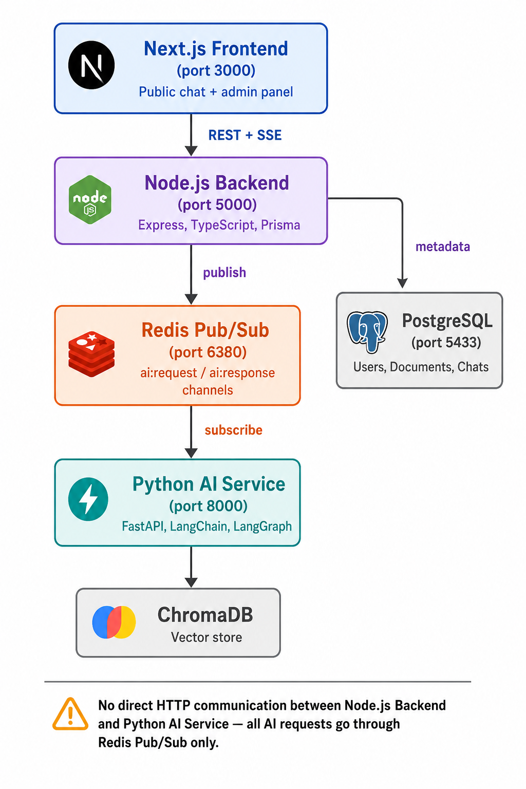

# PDF Knowledge Base AI Chatbot (RAG System)

A microservice-based AI chatbot where an admin uploads PDF documents that become the knowledge base, and users can ask questions through a public chat interface. Built with a Next.js frontend, Node.js/Express backend, and a Python FastAPI AI service communicating via Redis Pub/Sub.

## Demo Video

[Watch the demo video](https://drive.google.com/file/d/119Np54N3p7LsH5aK1F_JpjhBa3Dcvnkr/view?usp=sharing)

## Architecture

```
Next.js Frontend (3000)
        |  REST + SSE
        v
Node.js Backend (5000)
   Express + TypeScript + Prisma
        |
   Redis Pub/Sub (6380)
        |
        v
Python AI Service (8000)
   FastAPI + LangChain + LangGraph
        |
        v
   ChromaDB (vector store)
        |
   PostgreSQL (5433) <- metadata: Users, Documents, Chats
```


The Node backend and Python AI service never talk directly. Every AI request (chat, PDF upload, PDF delete) is published to Redis on the `ai:request` channel, processed by the Python service, and the result is published back on `ai:response`, matched by a unique request ID.

## Tech Stack

- **Frontend:** Next.js (App Router), TypeScript, Tailwind CSS, shadcn/ui, react-markdown
- **Backend:** Node.js, Express, TypeScript, Prisma ORM
- **AI Service:** Python, FastAPI, LangChain, LangGraph, sentence-transformers (HuggingFace embeddings), Groq (LLM)
- **Database:** PostgreSQL (metadata) + ChromaDB (vector store)
- **Messaging:** Redis Pub/Sub
- **Containerization:** Docker Compose (all 5 services)

## Features

### Admin Panel
- Secure login (JWT-based)
- Dashboard: total PDFs, total chat sessions, total questions asked, recently uploaded documents
- Upload / search / delete / reprocess PDFs
- Automatic text extraction, chunking, embedding, and vector storage on upload

### Public Chat
- ChatGPT-style interface, no login required
- Streaming responses (SSE, word-by-word)
- Markdown rendering
- Source document name + page number shown per answer
- 3-5 AI-generated follow-up questions after every response (clickable)
- Conversation memory within a session

## Setup Instructions

### Option A — Docker Compose (recommended, single command)

**Prerequisites:** Docker Desktop, a free [Groq API key](https://console.groq.com)

1. Clone the repo:
   ```bash
   git clone https://github.com/Prajwal1905/rag-chatbot.git
   cd rag-chatbot
   ```

2. Create a `.env` file in the root with:
   ```
   GROQ_API_KEY=your_groq_api_key_here
   JWT_SECRET=any_long_random_string
   ```

3. Build and start everything:
   ```bash
   docker compose up --build
   ```

4. Once all services are up, register an admin account:
   ```bash
   curl -X POST http://localhost:5000/api/auth/register \
     -H "Content-Type: application/json" \
     -d '{"email":"admin@example.com","password":"yourpassword"}'
   ```

5. Access:
   - Public chat: http://localhost:3000
   - Admin login: http://localhost:3000/admin/login
   - Backend health check: http://localhost:5000/health
   - AI service docs (Swagger): http://localhost:8000/docs

### Option B — Manual setup (without Docker)

**Prerequisites:** Node.js 20, Python 3.11+, Docker Desktop (for Postgres + Redis only), Groq API key

1. Start Postgres and Redis:
   ```bash
   docker run -d --name rag-postgres -p 5433:5432 -e POSTGRES_PASSWORD=postgres -e POSTGRES_DB=ragdb postgres:16
   docker run -d --name rag-redis -p 6380:6379 redis:7
   ```

2. Copy env files:
   ```bash
   cp backend/.env.example backend/.env
   cp python-ai/.env.example python-ai/.env
   cp frontend/.env.local.example frontend/.env.local
   ```
   Fill in your real `GROQ_API_KEY` and a `JWT_SECRET` in the respective files.

3. Start the Python AI service:
   ```bash
   cd python-ai
   python -m venv venv
   venv\Scripts\Activate.ps1        # Windows
   # source venv/bin/activate       # macOS/Linux
   pip install torch --index-url https://download.pytorch.org/whl/cpu
   pip install -r requirements.txt
   uvicorn app.main:app --reload --port 8000
   ```

4. Start the Node backend:
   ```bash
   cd backend
   npm install
   npx prisma migrate dev --name init
   npm run dev
   ```

5. Start the frontend:
   ```bash
   cd frontend
   npm install
   npm run dev
   ```

## Database Schema

**User**
| Field     | Type            |
|-----------|-----------------|
| id        | UUID (PK)       |
| email     | String, unique  |
| password  | String (hashed) |
| createdAt | DateTime        |

**Document**
| Field            | Type                                                |
|------------------|------------------------------------------------------|
| id               | UUID (PK)                                            |
| fileName         | String                                               |
| uploadDate       | DateTime                                             |
| processingStatus | String (pending / processing / processed / failed)  |
| chunksCreated    | Int, nullable                                        |

**Chat**
| Field     | Type     |
|-----------|----------|
| id        | UUID (PK)|
| sessionId | String   |
| question  | String   |
| answer    | String   |
| timestamp | DateTime |

## API Documentation

### Auth
| Method | Endpoint              | Auth | Description           |
|--------|------------------------|------|------------------------|
| POST   | `/api/auth/register`  | No   | Create admin account  |
| POST   | `/api/auth/login`     | No   | Login, returns JWT     |

### Documents (Admin)
| Method | Endpoint                        | Auth | Description                                       |
|--------|-----------------------------------|------|------------------------------------------------------|
| POST   | `/api/documents/upload`         | Yes  | Upload PDF (multipart/form-data, field `file`)      |
| GET    | `/api/documents?search=`        | Yes  | List / search PDFs                                  |
| DELETE | `/api/documents/:id`            | Yes  | Delete a PDF and its vectors                        |
| POST   | `/api/documents/:id/reprocess`  | Yes  | Re-trigger processing status                        |

### Chat (Public)
| Method | Endpoint                        | Auth | Description                                        |
|--------|-----------------------------------|------|-------------------------------------------------------|
| POST   | `/api/chat/ask`                 | No   | Ask a question, returns full JSON response           |
| POST   | `/api/chat/ask-stream`          | No   | Ask a question, returns SSE stream (word-by-word)    |
| GET    | `/api/chat/history/:sessionId`  | No   | Get chat history for a session                       |

### Stats (Admin)
| Method | Endpoint     | Auth | Description                                             |
|--------|---------------|------|------------------------------------------------------------|
| GET    | `/api/stats` | Yes  | Total PDFs, chat sessions, questions asked, recent docs   |

## LangGraph Workflow

```
Receive Question -> Retrieve Context (Chroma similarity search)
                  -> Generate Answer (Groq LLM, grounded in context)
                  -> Generate Suggested Questions (3-5, based on Q&A)
                  -> Return Response
```

If the retrieved context doesn't contain the answer, the model is instructed to say so rather than guess.

## Known Limitations

- **Reprocess PDF** currently updates the status flag only; full re-embedding would require persisting original files long-term, which was scoped out to keep storage light for this assignment.
- Streaming is implemented at the Node layer: the AI service computes the full answer via Redis, then Node streams it to the client word-by-word over SSE. This preserves the mandatory Redis-only communication pattern between backend and AI service, since raw token-by-token streaming isn't natively supported over Redis Pub/Sub.